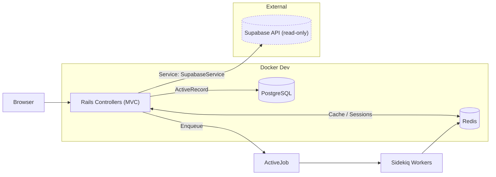

# Architecture Overview

## System Components
- Rails 8.0.2 (Ruby 3.3.1)
- PostgreSQL (local) for app data
- Supabase (remote) for product/catalog data (read-only)
- Redis for caching and Sidekiq jobs
- Docker for dev environment

## Diagram

## High-Level Flow
1. Browser requests hit Rails controllers
2. App data persists to PostgreSQL
3. Product data fetched via `SupabaseService` (read-only)
4. Frequently accessed data cached in Redis
5. Background jobs processed by Sidekiq

## Wizard Flow
- 8 steps under `app/views/wizard/steps/`
- Progress persisted in `WizardSession`
- Selections persisted in `ComponentSelection`

## Key Services
- `SupabaseService` handles API calls and caching for systems, components, images

## Ports (Dev)
- Web: 3000
- Postgres: 5432
- Redis: 6379
- LiveReload: 35729

