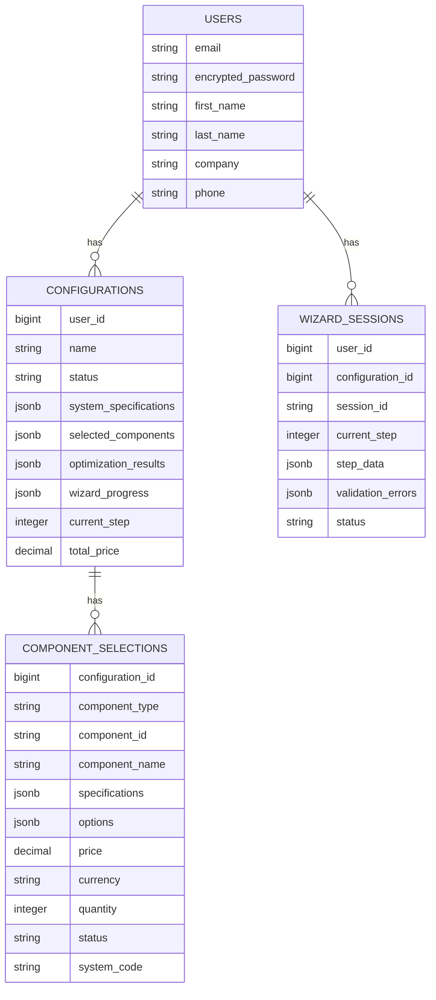

# Data Model

## Users
- Authentication via Devise
- Fields: email, encrypted_password, names, company, phone, etc.

## Configurations
- Belongs to `User`
- Fields: name, description, status, `system_specifications` (jsonb), `selected_components` (jsonb), `wizard_progress` (jsonb), `current_step`, `total_price`

## WizardSessions
- Belongs to `User`
- Optional `configuration_id`
- Fields: session_id, current_step, `step_data` (jsonb), `validation_errors` (jsonb), timestamps, status

## ComponentSelections
- Belongs to `Configuration`
- Fields: component_type, component_id, component_name, `specifications` (jsonb), `options` (jsonb), price, currency, quantity, notes, status, selected_at, system_code

## Relationships
- User has many Configurations
- Configuration has many ComponentSelections
- User has many WizardSessions

